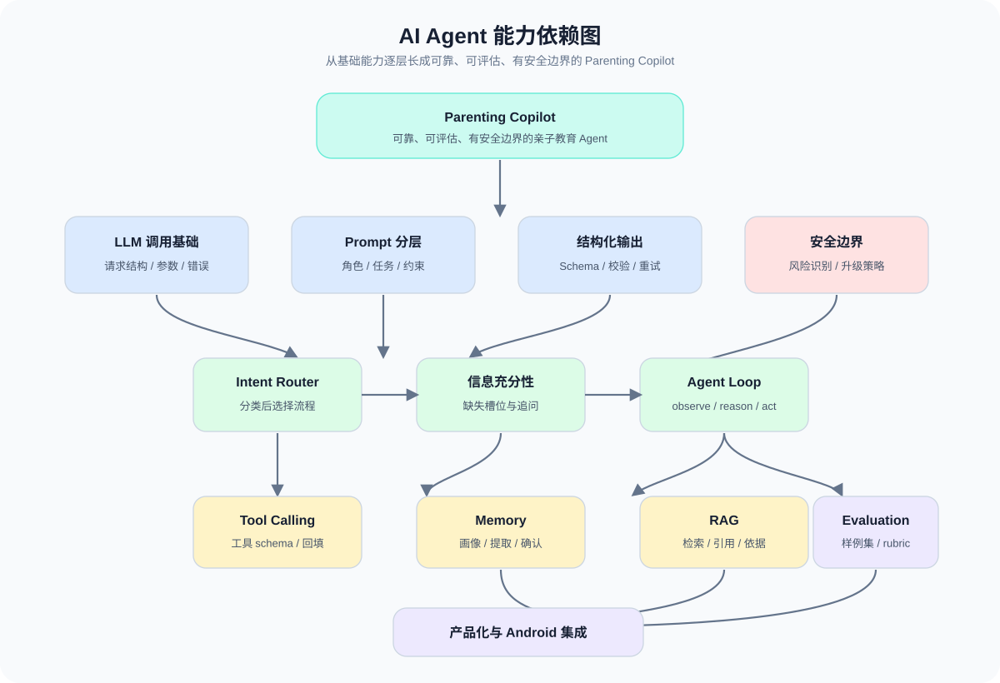
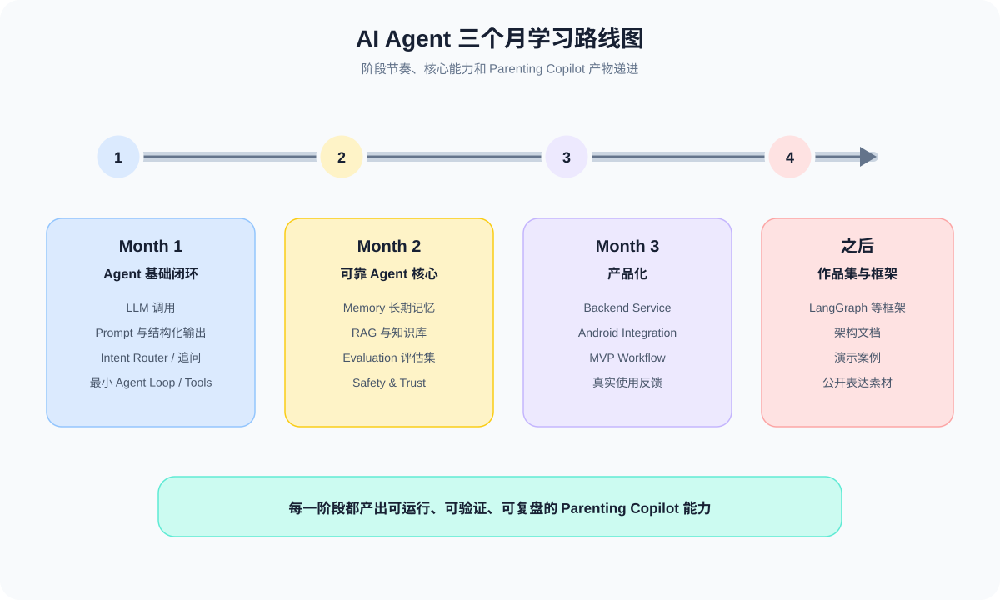
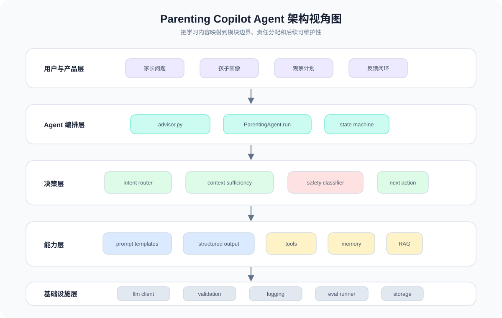

# AI Agent 学习地图

这份文档是完整能力地图，不是按日期死排的计划。它回答：

- AI Agent 开发到底要学哪些能力？
- 每个能力解决什么问题？
- 如何通过 Parenting Copilot 这个项目练出来？
- 后续 `CHECKLIST.md` 应该如何拆成可领取任务？

每天真正执行时，从 `CHECKLIST.md` 领取任务；学习方向和阶段边界以本路线图为准。

## 总览

AI Agent 开发不是单点能力，而是一套系统工程能力：

```text
LLM 基础
  -> Prompt 与结构化输出
  -> Agent Core
  -> Tool Use
  -> Memory
  -> RAG
  -> Evaluation
  -> Safety
  -> Product Engineering
  -> Frameworks
  -> Android Integration
  -> Product MVP
  -> Portfolio / Career / Startup
```

本项目主线：

```text
Parenting Copilot / 亲子教育 Agent
```

## 可视化学习地图

这三张图从不同角度查看同一条学习主线：

- **能力依赖图**：看清哪些 Agent 能力依赖哪些前置能力。
- **路线图**：看清三个月内的阶段节奏和主要产物。
- **架构视角图**：看清学习内容如何落到 Parenting Copilot 的模块边界。







每个阶段都要回到三层理解：

```text
概念层：它解决什么问题？
工程层：如何用代码实现？
产品层：它如何改善 Parenting Copilot？
```

## Phase 0: Learning System

核心问题：

- 如何让学习过程可持续？
- 如何把代码、笔记、复盘和产品设计连起来？
- 如何用 Obsidian 建立长期知识网络？

你要掌握：

- `AGENTS.md` 协作规则。
- `CHECKLIST.md` 任务领取方式。
- Obsidian 首页与模板。
- 每日目标定义和验收方式。

推荐实验：

- 把当前项目作为 Obsidian Vault 打开。
- 从 `notes/000 AI Agent 学习首页.md` 进入学习。
- 用模板写一篇每日学习笔记。

Parenting Copilot 中的应用：

- 把每个学习产物都沉淀为产品能力、架构设计或实验代码。

阶段产物：

- Obsidian 学习首页。
- 每日学习模板。
- 可执行清单。
- 周复盘模板。

## Phase 1: LLM Application Foundation

核心问题：

- 如何稳定调用 LLM？
- 一次 LLM 请求包含哪些部分？
- 模型参数如何影响输出？

你要掌握：

- System message、user message、developer message 的职责。
- Model、temperature、max tokens、streaming。
- API key、环境变量、错误处理。
- 同步调用与流式调用。

推荐实验：

- 写一个最小 Python 脚本调用 LLM。
- 比较不同 temperature 下的输出稳定性。
- 加入错误处理和重试。

Parenting Copilot 中的应用：

- 实现第一个家长问题回答器。

阶段产物：

- `parenting_advisor.py`。
- LLM 调用笔记。
- API 调用错误处理策略。

## 横向专题: LLM 原理 for Agent Engineering

定位：

- 这是插在 Phase 1 和 Phase 2 之间的专题，不是新的大阶段。
- 目标不是成为模型研究员，而是理解 LLM 的工程行为边界。
- 每个原理都要映射到 Agent 设计、验证策略和 Parenting Copilot 的安全边界。

核心问题：

- LLM 为什么像预测器，而不是规则引擎？
- Token、context window 和截断如何影响 Agent 可靠性？
- 为什么 prompt 更像接口契约，而不是自然语言命令？
- 为什么结构化输出、tool calling、memory、RAG、evaluation 和 safety 都需要程序边界？

你要掌握：

- Next-token prediction 的工程含义。
- Token、上下文窗口、上下文污染和信息丢失。
- Prompt as Interface: system、task、format、safety prompt 的职责边界。
- 结构化输出漂移、schema validation、retry、fallback。
- Tool calling 中“模型负责选择，代码负责执行和校验”的分工。
- Evaluation 作为 Agent 工程质量的最低保障。

推荐实验：

- 对同一个问题改变上下文和输出约束，观察回答稳定性。
- 故意给模型冲突指令，观察 system/task/format 约束的边界。
- 构造坏 JSON、缺字段、越界建议，验证 schema 和 fallback 为什么必要。

Parenting Copilot 中的应用：

- 教育类建议必须区分事实、假设、建议和风险信号。
- 信息不足时先追问，而不是直接给确定建议。
- 高风险场景不能只依赖一句 safety prompt，要结合路由、校验、模板和人工边界。

阶段产物：

- `notes/LLM 原理 for Agent Engineering.md`。
- 一组“LLM 原理 -> Agent 设计边界”的映射。
- 后续 Prompt、Agent Core、Tool Use、Memory、RAG、Evaluation、Safety 的底层解释入口。

## Phase 2: Prompt & Structured Output

核心问题：

- Prompt 如何从“自然语言提示”变成“系统接口”？
- 为什么 Agent 需要结构化输出？
- 如何验证模型输出？

你要掌握：

- Prompt 分层：角色、任务、上下文、约束、输出格式。
- JSON schema / Pydantic。
- Few-shot examples。
- 输出校验与失败重试。
- 普通聊天输出和结构化输出的差异。

推荐实验：

- 定义 `ParentingAdvice` 数据模型。
- 让模型输出固定 JSON。
- 故意制造非法输出，观察校验和修复流程。

Parenting Copilot 中的应用：

- 输出问题判断、可能原因、行动步骤、沟通话术、风险提醒。

阶段产物：

- `ParentingAdvice` schema。
- Prompt 模板。
- 结构化输出验证器。

## Phase 3: Agent Core

核心问题：

- Agent 和普通聊天机器人有什么不同？
- Agent 如何决定下一步做什么？
- 如何把复杂任务拆成可控流程？

你要掌握：

- Agent loop：observe、reason、act、persist。
- Intent routing。
- Planning。
- Clarifying questions。
- State machine。
- Human-in-the-loop。
- Failure recovery。

推荐实验：

- 实现 Intent Router。
- 实现信息不足时的追问机制。
- 手写最小 `ParentingAgent.run()`。
- 用状态机表达 Agent 流程。

Parenting Copilot 中的应用：

- 先判断问题类型，再决定追问、回答、查资料或触发安全策略。

阶段产物：

- Intent Router。
- Clarifying Questions。
- 最小 Agent Loop。
- Agent 状态图。

## Phase 4: Tool Use

核心问题：

- LLM 如何从“会说”变成“会做”？
- 工具 schema 如何设计？
- 哪些能力应该用代码实现，而不是交给模型自由发挥？

你要掌握：

- Function calling / tool calling。
- Tool schema。
- 参数生成与校验。
- 工具结果回填。
- 工具调用日志。
- 幂等性和错误处理。

推荐实验：

- 实现 `get_child_profile`。
- 实现 `create_weekly_plan`。
- 实现一个安全检查工具。
- 记录每次工具调用输入、输出和失败原因。

Parenting Copilot 中的应用：

- Agent 可以读取孩子档案、生成观察计划、调用知识库检索。

阶段产物：

- 工具接口设计。
- 工具调用链路。
- 工具日志。

## Phase 5: Memory

核心问题：

- 长期陪伴型 Agent 如何记住用户？
- 什么信息值得进入长期记忆？
- 如何避免错误记忆、过度记忆和隐私风险？

你要掌握：

- Short-term memory。
- Long-term memory。
- Profile memory。
- Event memory。
- Preference memory。
- Memory extraction。
- Memory confidence。
- Forgetting / update strategy。

推荐实验：

- 设计孩子画像和家长画像。
- 从一次对话中提取新事实、观察和后续跟进点。
- 区分事实、推测和建议。
- 实现记忆更新确认机制。

Parenting Copilot 中的应用：

- 随着家长和孩子一起成长，逐步形成长期成长档案。

阶段产物：

- Child Profile。
- Parent Profile。
- Event Memory。
- Memory Extractor。
- 记忆更新策略。

## Phase 6: RAG & Knowledge System

核心问题：

- 如何让 Agent 基于可靠资料回答？
- 检索结果如何影响最终答案？
- 如何提供引用和不确定性说明？

你要掌握：

- Document parsing。
- Chunking。
- Embedding。
- Vector search。
- Hybrid search。
- Rerank。
- Query rewrite。
- Citation。
- Knowledge versioning。

推荐实验：

- 建立最小教育知识库。
- 对比不同 chunk 策略。
- 对比向量检索和关键词检索。
- 输出带来源引用的建议。

Parenting Copilot 中的应用：

- 回答家庭教育问题时引用可靠资料，而不是只靠模型常识。

阶段产物：

- 教育知识库。
- 检索链路。
- 带引用回答。
- 检索质量评估表。

## Phase 7: Evaluation

核心问题：

- 如何判断 Agent 是否真的可靠？
- 如何避免每次改 prompt 都靠感觉？
- 如何建立回归测试？

你要掌握：

- Eval dataset。
- Rubric。
- Golden answer。
- LLM-as-judge 的边界。
- Regression test。
- Hallucination check。
- Safety eval。
- Cost and latency eval。

推荐实验：

- 建立 50 条亲子教育问题测试集。
- 为每条样例定义期望行为。
- 对 Agent 回答做多维评分。
- 比较不同 prompt 版本的得分。

Parenting Copilot 中的应用：

- 用评估集保证输出具体、安全、尊重孩子、有专业边界。

阶段产物：

- Eval dataset。
- 评分规则。
- 回归测试脚本。
- Prompt 版本对比报告。

## Phase 8: Safety & Trust

核心问题：

- 教育类 Agent 不能做什么？
- 高风险场景如何降级？
- 如何让系统表达不确定性？

你要掌握：

- Risk classification。
- Guardrails。
- Human confirmation。
- Crisis escalation。
- Professional boundary。
- Uncertainty expression。
- Child safety。
- Privacy by design。

推荐实验：

- 设计普通、复杂、高风险、紧急四级响应。
- 构造霸凌、心理健康、家庭冲突等测试样例。
- 检查 Agent 是否越界诊断或给出危险建议。

Parenting Copilot 中的应用：

- 高风险问题不直接给诊断，而是给低风险沟通建议并引导专业支持。

阶段产物：

- Safety Policy。
- Risk Classifier。
- 高风险评估集。
- 安全响应模板。

## Phase 9: Product Engineering

核心问题：

- 如何把 demo 变成稳定服务？
- Agent 系统如何部署、观测和维护？
- 如何控制成本、延迟和权限？

你要掌握：

- FastAPI。
- PostgreSQL。
- pgvector / Qdrant。
- Redis / task queue。
- Auth。
- Logging。
- Tracing。
- Cost tracking。
- Rate limit。
- Background jobs。

推荐实验：

- 把命令行 Agent 封装成 FastAPI。
- 保存对话记录和记忆。
- 加入请求日志和 token 成本统计。
- 增加后台任务处理长耗时流程。

Parenting Copilot 中的应用：

- 形成可以被 Web 或 Android 客户端调用的 Agent Backend。

阶段产物：

- FastAPI Agent service。
- 数据库 schema。
- 日志与成本统计。
- 部署说明。

## Phase 10: Agent Frameworks

核心问题：

- 什么时候需要 Agent 框架？
- 框架解决了什么，又隐藏了什么？
- 如何避免被框架牵着走？

你要掌握：

- LangGraph。
- AutoGen。
- CrewAI。
- OpenAI Agents SDK 或同类框架。
- Workflow graph。
- Multi-agent collaboration。
- Checkpoint / persistence。

推荐实验：

- 用手写 Agent Loop 实现一次。
- 再用 LangGraph 或其他框架重写同一流程。
- 对比代码复杂度、可控性、可测试性。

Parenting Copilot 中的应用：

- 将复杂流程如“检索、风险判断、建议生成、记忆更新”表达为可视化或可持久化工作流。

阶段产物：

- 框架对比笔记。
- 一个框架版 Agent workflow。
- 是否采用框架的决策记录。

## Phase 11: Android Integration

核心问题：

- Android 客户端如何和 Agent 后端配合？
- 移动端适合承担哪些职责？
- 如何设计长期陪伴型产品体验？

你要掌握：

- Agent Backend API。
- Streaming response。
- Offline cache。
- Conversation UI。
- Push / reminder。
- Local privacy。
- Android 架构与 Agent 状态同步。

推荐实验：

- 设计 Android 与 Agent Backend 的接口。
- 做一个最小聊天/建议页面原型。
- 实现流式响应展示。
- 设计成长档案页面。

Parenting Copilot 中的应用：

- 家长可以在手机上快速提问、查看建议、记录反馈和接收后续提醒。

阶段产物：

- Android API contract。
- 移动端信息架构。
- 关键页面原型。
- Streaming demo。

## Phase 12: Parenting Copilot MVP

核心问题：

- 什么才是第一个可展示、可试用的产品版本？
- 如何证明这个 Agent 真的有价值？
- 如何收集反馈并持续改进？

你要掌握：

- MVP definition。
- User journey。
- Onboarding。
- Feedback loop。
- Retention hooks。
- Data consent。
- Product analytics。

推荐实验：

- 做出 v0.1 Demo。
- 找 3-5 个真实场景测试。
- 收集家长反馈。
- 用反馈更新评估集和产品设计。

Parenting Copilot 中的应用：

- 从学习项目进入真实产品验证。

阶段产物：

- Parenting Copilot v0.1。
- Demo script。
- 用户反馈记录。
- v0.2 迭代计划。

## Phase 13: Portfolio & Career

核心问题：

- 如何把学习过程变成可展示能力？
- 面试时如何讲清楚 Agent 架构？
- Android 架构师如何转向 AI Agent 工程？

你要掌握：

- Project storytelling。
- Architecture write-up。
- Demo recording。
- Technical blog。
- Resume bullet。
- Interview explanation。

推荐实验：

- 写一篇“Android 架构师如何理解 AI Agent 架构”。
- 准备 5 分钟 demo。
- 准备 Agent 系统设计面试讲解。

Parenting Copilot 中的应用：

- 把项目沉淀成作品集，而不是只留在本地代码里。

阶段产物：

- 项目 README 完整版。
- 架构文章。
- Demo 视频脚本。
- 面试讲稿。

## Phase 14: Startup Validation

核心问题：

- 这个方向是否有真实用户需求？
- 家长愿意为什么能力付费？
- 教育类 Agent 的边界和商业化风险是什么？

你要掌握：

- Problem interview。
- User segmentation。
- Value proposition。
- Pricing hypothesis。
- Risk analysis。
- Compliance awareness。
- Go-to-market basics。

推荐实验：

- 访谈 5-10 位家长。
- 记录真实问题和高频场景。
- 区分“好玩功能”和“刚需能力”。
- 设计付费前验证实验。

Parenting Copilot 中的应用：

- 从个人学习项目走向创业产品验证。

阶段产物：

- 用户访谈记录。
- 需求优先级。
- 商业假设。
- 风险清单。

## 阶段关系

建议顺序：

```text
Phase 0 -> Phase 1 -> Phase 2 -> Phase 3
  -> Phase 4 -> Phase 5 -> Phase 6
  -> Phase 7 -> Phase 8 -> Phase 9
  -> Phase 10 / Phase 11
  -> Phase 12
  -> Phase 13 / Phase 14
```

其中：

- Phase 1-3 是 Agent 基础闭环。
- Phase 4-8 是可靠 Agent 的核心。
- Phase 9-12 是产品化能力。
- Phase 13-14 是求职、作品集和创业验证。

## 后续 CHECKLIST 设计原则

`CHECKLIST.md` 不应该继续无限按天编号，而应该改成阶段任务池：

```text
Foundation Tasks
Agent Core Tasks
Tool Use Tasks
Memory Tasks
RAG Tasks
Evaluation Tasks
Safety Tasks
Product Engineering Tasks
Android Integration Tasks
Portfolio Tasks
Startup Validation Tasks
```

每个任务包含：

```text
目标
你要理解
你要实现
验收标准
Obsidian 笔记
复盘问题
```
